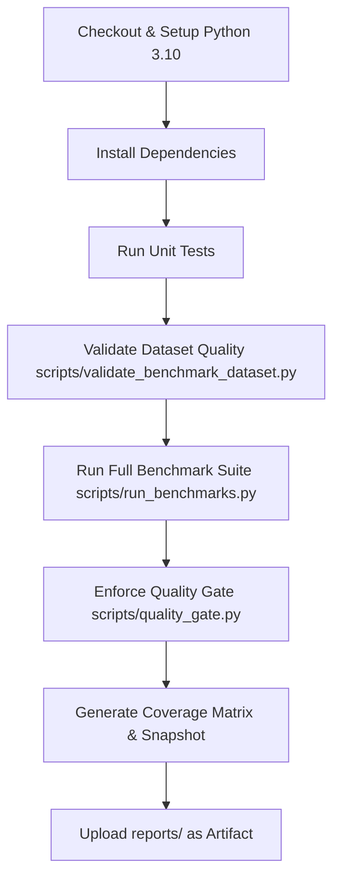

# Brevix AI — Benchmark System Documentation & Index

Welcome to the comprehensive guide for the Brevix AI Benchmark System. This document serves as the main index and user manual for building, running, and maintaining high-quality benchmarks for the LangGraph-based agent orchestration service.

---

## Table of Contents
1. [Benchmark System Overview](#1-benchmark-system-overview)
2. [Dataset Structure](#2-dataset-structure)
3. [Scenario Authoring Rules](#3-scenario-authoring-rules)
4. [Required Scenario Fields](#4-required-scenario-fields)
5. [How to Use the Scenario Template](#5-how-to-use-the-scenario-template)
6. [How to Validate Datasets](#6-how-to-validate-datasets)
7. [How to Run All Benchmarks](#7-how-to-run-all-benchmarks)
8. [How to Run Filtered Benchmarks](#8-how-to-run-filtered-benchmarks)
9. [How to Generate Reports](#9-how-to-generate-reports)
10. [How to Read Quality Gate Results](#10-how-to-read-quality-gate-results)
11. [How to Read Benchmark Snapshots](#11-how-to-read-benchmark-snapshots)
12. [How to Read Coverage Matrix Reports](#12-how-to-read-coverage-matrix-reports)
13. [How to Compare Benchmark History](#13-how-to-compare-benchmark-history)
14. [Prompt Versioning and Prompt Hash Rules](#14-prompt-versioning-and-prompt-hash-rules)
15. [CI Workflow Summary](#15-ci-workflow-summary)
16. [Release-Readiness Checklist](#16-release-readiness-checklist)

---

## 1. Benchmark System Overview

The Brevix AI Benchmark System is designed to evaluate stateful, multi-step LLM orchestration workflows deterministically, repeatably, and without making external API calls. 

Rather than executing live transactions or querying active third-party LLM providers (which introduces non-deterministic flake and high latency in CI pipelines), the system:
* Uses a **Deterministic Model Provider** ([app/providers/deterministic.py](file:///Users/joe.eagan/Documents/GitHub/brevixai-agents/app/providers/deterministic.py)) to simulate realistic agent responses.
* Resolves internal tool calls using standard test fixtures rather than querying Postgres.
* Evaluates agent behaviors (intent classification, findings extraction, triage severity, evidence matching, and false-positive suppression) against rigorous ground-truth metrics.

---

## 2. Dataset Structure

The benchmark dataset is located at [datasets/fraud_benchmarks.json](file:///Users/joe.eagan/Documents/GitHub/brevixai-agents/datasets/fraud_benchmarks.json). It is a structured JSON array containing simulated fraud scenarios that exercise different parts of the Brevix agent orchestration layer.

Each entry represents a single evaluation scenario. Structurally, each scenario contains:
1. **Metadata Fields**: Basic categorization (e.g. category, risk type, tags).
2. **Execution Inputs**: Simulated user input prompt and company state context.
3. **Database Seed State**: Seed data (companies, vendors, employees, transactions) that the deterministic backend serves when the agent makes tool calls.
4. **Tool Fixtures**: Expected backend responses for the specialist nodes.
5. **Evaluation Contract**: Explicit expectations (e.g. expected findings, severity, evidence, recommendations, and false-positive guardrail phrases).

---

## 3. Scenario Authoring Rules

To keep the benchmark dataset clean, robust, and maintainable, all scenario authors must adhere to the following rules:

* **Use lowercase `snake_case`**: All `scenario_id` values must conform to the format `^[a-z0-9_]+$`. No spaces, camelCase, or hyphens.
* **Maintain ID Uniqueness**: A `scenario_id` must be completely unique across the entire dataset.
* **No Raw PII or Sensitive Data**: Do not include real-world private data (SSNs, plain passwords, live API keys, routing numbers, plain bank accounts, CVVs, or PINs). Always use anonymous or masked dummy placeholders (e.g., `"tax_id": "XXX-XX-5512"`).
* **Non-Empty Constraints**: Lists such as `tags`, `expected_findings`, `expected_evidence_patterns`, and `false_positive_guardrails` must never be empty.
* **Valid Categorization**: Ensure the `category`, `risk_type`, and `tags` use values aligned with existing systems to avoid fracturing filter groupings.

---

## 4. Required Scenario Fields

Every scenario JSON object must include exactly the following 12 fields:

| Field | Type | Description |
|---|---|---|
| `scenario_id` | string | Unique scenario identifier in lowercase snake_case (e.g. `ghost_vendor`). |
| `title` | string | Short, human-readable scenario title for reporting and UI (e.g. `Ghost Vendor Detection`). |
| `category` | string | The logical business category (e.g. `accounts_payable`, `vendor_management`, `payroll`, `accounting`). |
| `risk_type` | string | The classification of the fraud pattern (e.g. `ghost_vendor`, `duplicate_invoice`, `shell_entity`). |
| `severity` | string | Ground-truth risk severity. One of: `info`, `low`, `medium`, `high`, `critical`. |
| `tags` | list of strings | Searchable keywords for selective filtering (cannot be empty). |
| `input_prompt` | string | The simulated user instruction or question posed to the agent. |
| `expected_findings` | list of strings | Non-empty list of lowercase terms the agent must mention in its findings text. |
| `expected_severity` | string | Ground-truth severity the agent is expected to output (should match `severity`). |
| `expected_evidence_patterns` | list of dicts | Structure check ensuring appropriate evidence records are linked. |
| `expected_recommended_action` | string | Proposed next step the agent should recommend (e.g., `review_findings`). |
| `false_positive_guardrails` | list of strings | Non-empty list of terms characteristic of other fraud patterns that must NOT be mentioned. |

---

## 5. How to Use the Scenario Template

A pre-annotated scenario template is provided at [datasets/templates/fraud_scenario_template.json](file:///Users/joe.eagan/Documents/GitHub/brevixai-agents/datasets/templates/fraud_scenario_template.json).

### Steps to author a new scenario:
1. Open the [fraud_scenario_template.json](file:///Users/joe.eagan/Documents/GitHub/brevixai-agents/datasets/templates/fraud_scenario_template.json) file.
2. Copy the entire JSON object block.
3. Open [datasets/fraud_benchmarks.json](file:///Users/joe.eagan/Documents/GitHub/brevixai-agents/datasets/fraud_benchmarks.json) and paste the copied block at the end of the JSON array.
4. Modify all field values (excluding `_notes` and `_field_notes` fields) to describe your specific fraud scenario. Fill in the custom database seed payloads (e.g. `seeded_vendors`, `seeded_transactions`).
5. Run validation to ensure all quality rules pass.

---

## 6. How to Validate Datasets

We use an automated CLI tool to validate dataset quality. It scans file formatting, required fields, and recursively checks all seeded data for prohibited sensitive payloads.

### Run validation locally:
```bash
# Validate the default benchmarks dataset
python scripts/validate_benchmark_dataset.py

# Validate a specific draft scenario or template
python scripts/validate_benchmark_dataset.py datasets/templates/fraud_scenario_template.json
```

The script will print color-coded validation results. If any quality breach is found, it prints the errors and exits with code `1`. If successful, it prints `✔ Dataset is 100% valid!` and exits with code `0`.

---

## 7. How to Run All Benchmarks

To run the complete benchmark suite, execute the benchmarks runner. This exercises the agent orchestration layer over all scenarios, evaluates results deterministically, and writes outputs to the `reports/` folder.

### Run command:
```bash
python scripts/run_benchmarks.py --report
```

*Note: Make sure your python virtual environment is active (`source .venv/bin/activate`) before executing.*

---

## 8. How to Run Filtered Benchmarks

To speed up local development or focus testing on a specific domain, you can filter benchmark runs using selective flags. Filters can be combined (behaves as `AND` logic):

```bash
# Filter by Category
python scripts/run_benchmarks.py --report --category vendor_management

# Filter by Severity
python scripts/run_benchmarks.py --report --severity high

# Filter by a single Tag
python scripts/run_benchmarks.py --report --tag vendor

# Filter by multiple Tags (AND logic)
python scripts/run_benchmarks.py --report --tag vendor --tag entity_graph

# Filter by specific Risk Type
python scripts/run_benchmarks.py --report --risk-type duplicate_invoice
```

---

## 9. How to Generate Reports

When you run `python scripts/run_benchmarks.py --report`, two main report files are written to the [reports/](file:///Users/joe.eagan/Documents/GitHub/brevixai-agents/reports) directory:

1. **`reports/latest_benchmark_report.json`**:
   The machine-readable, structured JSON output containing all execution outcomes, per-scenario latency, evaluated scores (pass/fail checks), prompt versions, and active filter flags.
   
2. **`reports/latest_benchmark_report.md`**:
   The human-readable Markdown breakdown containing a detailed tabular log of all scenarios, execution summaries, elapsed times, and specific failure details for debugging.

---

## 10. How to Read Quality Gate Results

The Quality Gate script acts as the automated release guard. It evaluates a benchmark report against strict predefined metric thresholds:

### Command:
```bash
python scripts/quality_gate.py --report-json reports/latest_benchmark_report.json
```

### Metrics & Thresholds Checked:
* **Pass Rate** (`>= 95%`): Fraction of all scenarios that passed all contract and evaluation checks.
* **Severity Accuracy** (`>= 95%`): Fraction of scenarios where the agent matched the ground-truth risk severity.
* **Evidence Completeness Average** (`>= 90%`): Average fraction of expected evidence items correctly gathered by the agent.
* **False Positive Pass Rate** (`>= 95%`): Fraction of scenarios that did not trigger any false-positive guardrails.
* **Hallucination Failures** (`<= 0`): Maximum allowed scenarios containing invented evidence IDs or prohibited claims.
* **Average Latency** (`<= 500ms`): Maximum allowed average latency per scenario under deterministic mocks.

The Quality Gate exits `0` on success and `1` on failure (blocking deployment/PR merges).

---

## 11. How to Read Benchmark Snapshots

A polished, human-readable snapshot of the latest benchmark run is written to [reports/BENCHMARK_SNAPSHOT.md](file:///Users/joe.eagan/Documents/GitHub/brevixai-agents/reports/BENCHMARK_SNAPSHOT.md).

### Snapshot Sections:
* **Release Readiness Status**: Displays either `READY` (all quality gate checks passed) or `REVIEW REQUIRED` (one or more quality gate thresholds breached).
* **Quality Metrics**: A formatted table listing the target threshold, actual score, and pass/fail outcome for all 6 core metrics.
* **Prompt Versions**: Displays a list of active prompts and stable short hashes.
* **Slowest Scenarios**: Highlights performance bottlenecks to prevent latency regression.

### Local Generation:
```bash
python scripts/generate_benchmark_snapshot.py
```

---

## 12. How to Read Coverage Matrix Reports

The coverage matrix tracks which categories, risk types, severities, and tags are exercised by the benchmark suite. It is generated by scanning the dataset files.

### Generate Matrix:
```bash
python scripts/generate_coverage_matrix.py
```

### Outputs Written:
* **`reports/coverage_matrix.json`**: Machine-readable counts.
* **`reports/coverage_matrix.md`**: Human-readable coverage matrices, dataset quality tables, and **Recommended Gaps to Fill Next** (which flags under-tested categories or tags).

---

## 13. How to Compare Benchmark History

To prevent slow quality erosion or identify exactly which commit introduced a bug, use the history comparison tool:

### 1. Save a timestamped copy:
When running benchmarks, add the `--history` flag to store a persistent, timestamped snapshot in `reports/history/`:
```bash
python scripts/run_benchmarks.py --report --history
```

### 2. Compare reports:
```bash
python scripts/compare_benchmark_reports.py \
  --base reports/history/benchmark_report_20260515_100000.json \
  --current reports/latest_benchmark_report.json
```

This runs a structural diff, checking for changes in pass rate, scenario latency changes, coverage count drift, and identifies exactly which scenarios regressed or improved.

---

## 14. Prompt Versioning and Prompt Hash Rules

The agent service loads prompt templates from [app/prompts/](file:///Users/joe.eagan/Documents/GitHub/brevixai-agents/app/prompts/). Prompt templates carry frontmatter metadata (prompt name and prompt version).

### Rules for Prompt Templates:
1. **Automatic Hash Tracking**: At load time, the service computes a SHA-256 hash of the template file content. This hash is embedded into all execution trace metadata and report files.
2. **The Golden Rule**: **Never edit a prompt version (e.g. `v1`) once it has been benchmarked.**
   Changing a prompt file breaks the stability of old hashes in historical benchmark files, destroying regression correlation.
3. **Adding Prompt Changes**: If you need to modify a prompt template (e.g. tweak instructions for the `explanation` node):
   * Create a new file in `app/prompts/` (e.g., `explanation.v2.md`).
   * Increment the version number in frontmatter to `v2`.
   * Update the configuration loader in `app/prompts/loader.py` to target the new version.
   * Run the benchmarks. The new unique `prompt_hash` will be recorded, preserving historical regression logs.

---

## 15. CI Workflow Summary

The CI pipeline is automated via GitHub Actions in [.github/workflows/benchmark-quality-gate.yml](file:///Users/joe.eagan/Documents/GitHub/brevixai-agents/.github/workflows/benchmark-quality-gate.yml).

### Steps Executed in CI:


If the validator CLI or the quality gate checks fail, the workflow run is marked as failed, blocking the PR from being merged.

---

## 16. Release-Readiness Checklist

Before merging a pull request or deploying a release of the agent orchestration service to production, complete this checklist:

- [ ] **Run Unit Tests**: Ensure all fast unit tests pass: `pytest tests/ --ignore=tests/test_evals.py -q`
- [ ] **Validate Dataset**: Confirm the benchmarks file conforms to quality guidelines and is free of PII: `python scripts/validate_benchmark_dataset.py`
- [ ] **Execute Benchmarks**: Run the full evaluation suite: `python scripts/run_benchmarks.py --report`
- [ ] **Pass Quality Gate**: Ensure all quality gate metrics pass local gates: `python scripts/quality_gate.py --report-json reports/latest_benchmark_report.json`
- [ ] **Verify Snapshot**: Open [reports/BENCHMARK_SNAPSHOT.md](file:///Users/joe.eagan/Documents/GitHub/brevixai-agents/reports/BENCHMARK_SNAPSHOT.md) and confirm the release readiness status is **`READY`**.
- [ ] **Check Prompt Hash Stability**: Verify that no active prompt files are modified; ensure prompt changes were introduced as new version files (e.g., `v2`).
